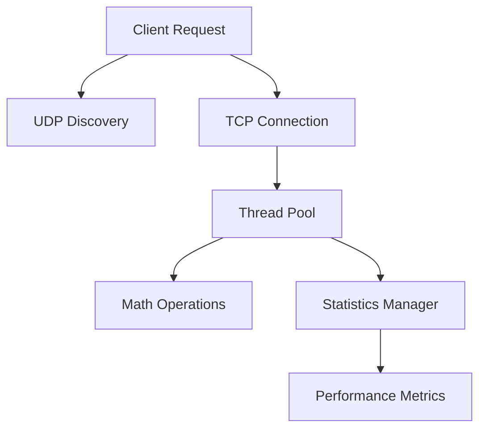

# 🌐 Centralized Computing System (CCS)

## 🎯 About the Project
The Centralized Computing System (CCS) is a robust, multi-threaded server application that provides distributed mathematical computation services. Built with Java, it demonstrates advanced networking, concurrent programming, and distributed systems concepts.



---

## 🚀 Key Features

### 🔄 Network Architecture
- **TCP/IP Server** 
  - Handles client connections
  - Manages mathematical computation requests
  - Ensures reliable data transmission

- **UDP Discovery Service**
  - Enables dynamic server discovery
  - Facilitates client-server connection
  - Implements service broadcasting

### 💻 Core Components

| Component | Description |
|-----------|-------------|
| `CentralizedComputingSystem` | Main server implementation |
| `ClientRequestHandler` | Manages individual client connections |
| `MathOperations` | Provides mathematical computation services |
| `StatisticsManager` | Tracks system performance metrics |
| `UDPDiscoveryServer` | Handles service discovery protocol |

### ⚡ Performance Features
- ✨ Multi-threaded architecture
- 🔄 Dynamic thread pool scaling
- 📊 Real-time statistics monitoring
- 🛡️ Error handling and recovery
- 🔌 Graceful shutdown mechanism

---

## 🛠️ Technical Architecture

```
📦 CCS
 ┣ 📂 src
 ┃ ┣ 📜 CentralizedComputingSystem.java
 ┃ ┣ 📜 ClientRequestHandler.java
 ┃ ┣ 📜 MathOperations.java
 ┃ ┣ 📜 StatisticsManager.java
 ┃ ┣ 📜 UDPDiscoveryServer.java
 ┃ ┗ 📜 Main.java
 ┗ 📜 README.md
```

### 🔧 System Components

#### 1️⃣ Server Core (`CentralizedComputingSystem.java`)
- Manages TCP connections
- Implements thread pooling
- Handles client requests
- Coordinates system components

#### 2️⃣ Mathematics Module (`MathOperations.java`)
- Basic arithmetic operations
- Error handling
- Extensible design

#### 3️⃣ Network Layer
- TCP server implementation
- UDP discovery service
- Connection management

#### 4️⃣ Monitoring System (`StatisticsManager.java`)
- Performance metrics
- Usage statistics
- System health monitoring

---

## 💡 Advanced Features

### 🔄 Load Balancing
```java
int processors = Runtime.getRuntime().availableProcessors();
this.clientThreadPool = Executors.newFixedThreadPool(processors * 4);
```
- Optimized thread pool sizing
- Dynamic resource allocation
- System performance optimization

### 📊 Statistics Monitoring
- Real-time performance tracking
- Connection statistics
- Operation metrics
- System health indicators

### 🛡️ Error Handling
- Robust exception management
- Graceful error recovery
- System stability maintenance

---

## 🚀 Getting Started

### Prerequisites
- Java JDK 8 or higher
- Network connectivity
- Available port for server operation

### Running the Server
```bash
java CentralizedComputingSystem <port>
```

### Configuration Options
- Port number specification
- Thread pool size adjustment
- Statistics reporting interval

---

## 🔍 Performance Metrics

### 📈 Monitoring
- Active connections
- Operation throughput
- Response times
- System resource usage

### 🎯 Optimization
- Automatic thread scaling
- Resource utilization
- Connection management

---

## 🛠️ Technical Stack
| Technology | Purpose |
|------------|----------|
| Java ☕ | Core programming |
| TCP/IP 🌐 | Primary communication |
| UDP 📡 | Service discovery |
| Threading 🧵 | Concurrent processing |
| JVM ⚡ | Runtime environment |

---

## 📚 Development Insights

### Best Practices Implemented
- ✅ Thread pool management
- ✅ Resource cleanup
- ✅ Error handling
- ✅ Performance monitoring
- ✅ Network protocol optimization

### Design Patterns Used
- 🏭 Factory Pattern
- 🎭 Singleton Pattern
- 👥 Observer Pattern
- 🔄 Thread Pool Pattern

---

## 🔮 Future Enhancements
- 🚀 Advanced load balancing
- 🔐 Security implementations
- 📊 Enhanced monitoring
- 🌐 Distributed computing features
- 🔄 Additional mathematical operations

---

## 📝 Summary
The Centralized Computing System demonstrates advanced Java programming concepts, network programming, and distributed systems principles. It provides a robust foundation for building scalable computation services.

---
